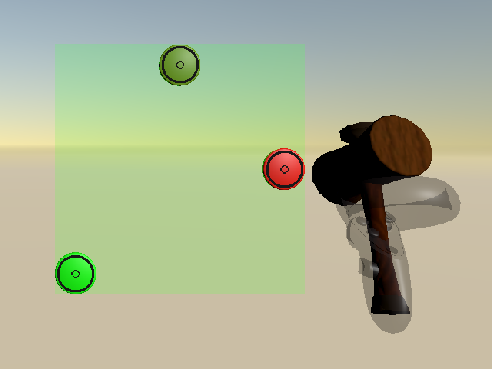

# User-in-the-Box iib project
This part of the repository aims to provide help to train the simulators on university HPC.

## Use conda env and Install Dependencies
First, under your working directory, clone the uitb_private and whac-a-mole repo respectively. The `uitb_private` repo is currently private, and if you need to clone it please contact `jh2425@cam.ac.uk` or Jiahao He in Teams. Note that there's a submodule in whac-a-mole, called sim2vr. To clone all the files, use the command below.
```bash
https://github.com/Leahh147/whac-a-mole.git --recurse-submodules
https://github.com/Leahh147/uitb_private.git
```

If you have already cloned `whac-a-mole` without the submodules, you can do the following step instead.
```bash
git submodule update --init --recursive
```

Switch to branch `iib_project` for both repo. Under `whac-a-mole/Assets/sim2vr`, switch to branch `iib_project` as well. This ensures all the changes are up-to-date.
For sim2vr:
```bash
cd whac-a-mole/Assets/sim2vr
```

```bash
git checkout iib_project
```

Then create a new conda env for the project using python 3.10.
```bash
conda init
conda create -n uitb-sim2vr python=3.10
pip3 install torch torchvision torchaudio --index-url https://download.pytorch.org/whl/cu121
conda activate uitb-sim2vr
pip install -e .
```

## Initiate a Training Script and Submit to the HPC
Write a bash file for task submission, and note that you will need to apply for HPC resources in advance, especially the GPU node in Prof.Kristensson's group.
```bash
#! /bin/bash
#SBATCH -A KRISTENSSON-SL3-GPU
#SBATCH -p ampere  ##SBATCH -p icelake-himem
#SBATCH -J uitb_train
#SBATCH --nodes=1
#SBATCH --time=00:15:00
#SBATCH -o "HPC_%x.%j.out"
#SBATCH -e "HPC_%x.%j.out"
#SBATCH --gres=gpu:1   #requires "#SBATCH -A KRISTENSSON-SL3-GPU" and "#SBATCH -p ampere"

cd ~/YOUR/OWN/PATH/TO/uitb_private

python uitb/train/trainer.py uitb/configs/mobl_arms_whacamole_constrained.yaml
```

## Questions
If there's any question, please ask Jiahao He `jh2425@cam.ac.uk`.

# Whac-A-Mole

A replication of the classic "Whac-A-Mole" arcade game, implemented as a VR game in Unity. This game is largely based on another Unity (boxing) exergame developed by Toni Pesola. 

For game details, see the paper ["SIM2VR: Towards Automated Biomechanical Testing in VR"](https://doi.org/10.1145/3654777.3676452) and the corresponding [GitHub repo](https://github.com/fl0fischer/sim2vr).

Screenshot of the game play:



## Dataset

We release a dataset of 18 people playing different variations of the game. See the above-mentioned paper for details regarding the data collection. The data can be found in the [dataset](https://github.com/aikkala/whac-a-mole/tree/main/dataset) directory, where there is a separate folder for each participant, and a spreadsheet with participant information. Participants 18, 37, and 39 were not used in the paper's user study, they were only invited to play the game to ensure a full dataset of 18 people in case of no-shows.


### Participant Information

The following participant information is available in the spreadsheet: 

- **ID**
- **age**
- **gender**
- **VR-exp**: experience playing VR games, chosen from "none", "some", "lots"
- **exercise**: approximation of how many hours the participant exercises weekly, using a very broad definition of exercise, including, e.g., brisk walking
- **humerus, ulna**: approximation of the humerus/ulna bone's length
- **order**: order of trials, chosen from "alpha", "bravo", "charlie", "delta", "echo", "foxtrot"
- **full-low, -mid, -high**: participant's reported Borg RPE value when considering fatigue felt in the whole body, for target area placement full, mid, or high (note: only these values were used in the publication)
- **arm-low, -mid, -high**: participant's reported Borg RPE value when considering fatigue felt in the shoulder and arm, for target area placement full, mid, or high

### Trial Order

- **alpha**: easy, medium, hard or low, mid, high
- **bravo**: easy, hard, medium or low, high, mid
- **charlie**: medium, easy, hard or mid, low, high
- **delta**: medium, hard, easy or mid, high, low
- **echo**: hard, easy, medium or high, low, mid
- **foxtrot**: hard, medium, easy or high, mid, low

## Troubleshooting

When building, if you get an error complaining something about erroneous "guid" for some prefabs/meshes go to "Assets" -> "Reimport all"

If you want to add more modes, please note that the Update function of SequenceManager runs before the Awake functions of some of the game objects. Add necessary checks to make sure there is no error in the Unity editor before training.
